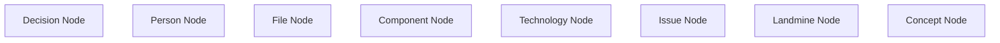
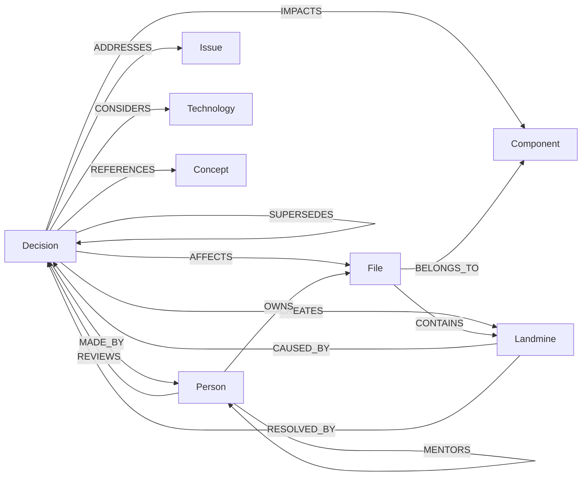
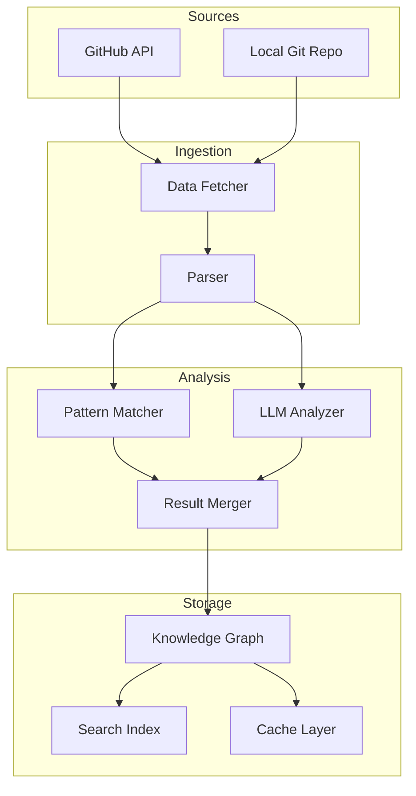
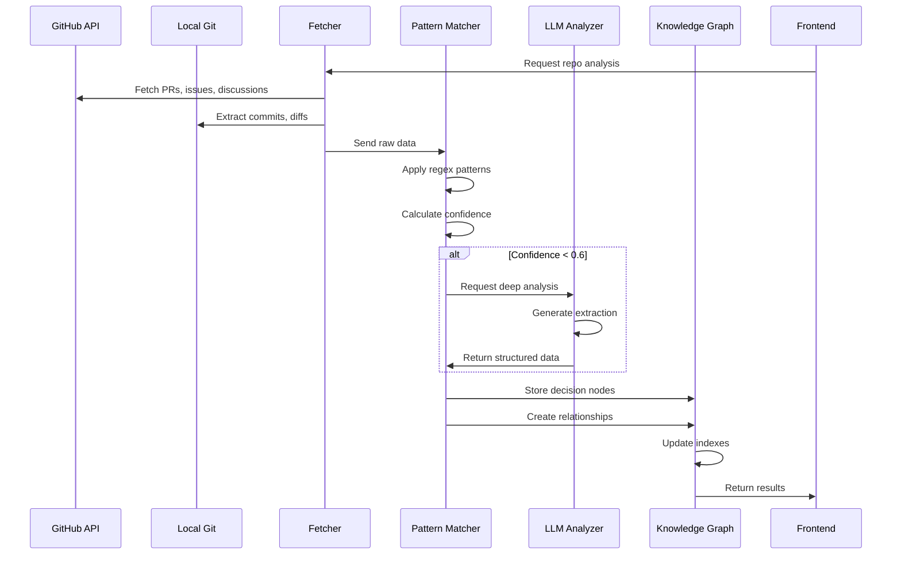
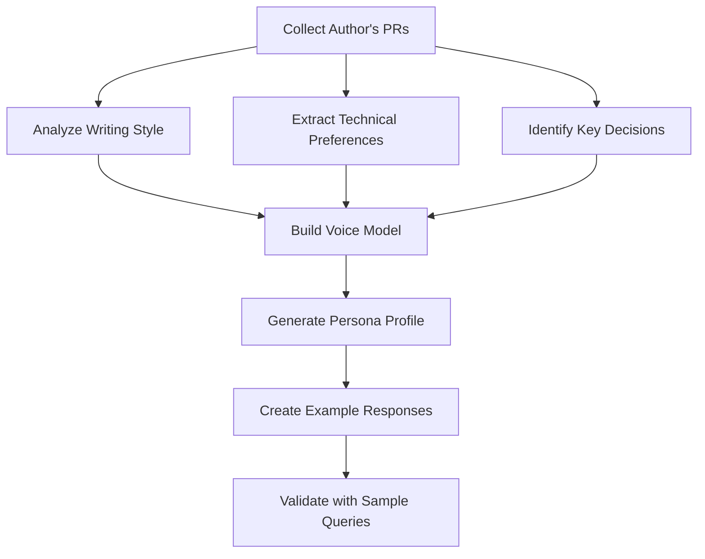
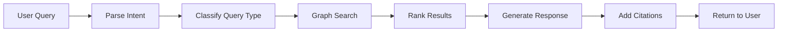
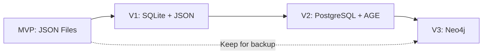

# Heirloom Knowledge Extraction Plan

## Executive Summary

This document outlines the data schema, extraction strategy, and Knowledge Graph architecture for the Heirloom project - a system designed to preserve institutional knowledge by extracting the "Why" behind decisions from PRs and commits, not just the "What" that changed.

**Key Approach**: Hybrid pattern matching + LLM analysis with in-memory graph structure and JSON storage for MVP.

---

## 1. Core Data Schema: Capturing "Why" vs "What"

### 1.1 Decision Entity Schema

```json
{
  "decision": {
    "id": "uuid",
    "type": "architectural|technical|process|refactor|bugfix",
    "timestamp": "ISO-8601",
    "title": "string",
    
    "what": {
      "changes": [
        {
          "file": "path/to/file",
          "linesAdded": "number",
          "linesRemoved": "number",
          "diffSummary": "string"
        }
      ],
      "summary": "Brief description of what changed"
    },
    
    "why": {
      "primaryReason": "string",
      "context": "string",
      "problemStatement": "string",
      "alternativesConsidered": [
        {
          "option": "string",
          "rejectedBecause": "string"
        }
      ],
      "tradeoffs": [
        {
          "gained": "string",
          "sacrificed": "string"
        }
      ],
      "constraints": ["string"],
      "futureImplications": "string"
    },
    
    "evidence": {
      "sourceType": "pr|commit|discussion|review",
      "sourceId": "string",
      "sourceUrl": "string",
      "extractionMethod": "pattern|llm|hybrid",
      "confidenceScore": "0.0-1.0",
      "keyQuotes": [
        {
          "text": "string",
          "author": "string",
          "context": "string"
        }
      ]
    },
    
    "metadata": {
      "repository": "string",
      "branch": "string",
      "prNumber": "number",
      "commitSha": "string",
      "authors": ["string"],
      "reviewers": ["string"],
      "labels": ["string"],
      "linkedIssues": ["string"]
    }
  }
}
```

### 1.2 Landmine Entity Schema

```json
{
  "landmine": {
    "id": "uuid",
    "severity": "critical|high|medium|low",
    "status": "active|resolved|monitoring",
    "location": {
      "file": "string",
      "function": "string",
      "lineRange": "string"
    },
    
    "warning": {
      "title": "string",
      "description": "string",
      "symptoms": ["string"],
      "rootCause": "string"
    },
    
    "history": [
      {
        "timestamp": "ISO-8601",
        "incident": "string",
        "impact": "string",
        "resolution": "string"
      }
    ],
    
    "prevention": {
      "recommendations": ["string"],
      "relatedDecisions": ["decision-id"],
      "documentation": "string"
    }
  }
}
```

### 1.3 Ghost Mentor Persona Schema

```json
{
  "persona": {
    "id": "uuid",
    "name": "string",
    "role": "string",
    "tenure": {
      "start": "ISO-8601",
      "end": "ISO-8601"
    },
    
    "profile": {
      "avatar": "emoji|url",
      "bio": "string",
      "expertise": ["string"],
      "philosophies": ["string"],
      "catchphrases": ["string"]
    },
    
    "contributions": {
      "decisionsAuthored": ["decision-id"],
      "filesOwned": ["string"],
      "prCount": "number",
      "impactScore": "number"
    },
    
    "voiceModel": {
      "writingStyle": "string",
      "commonPhrases": ["string"],
      "technicalPreferences": {
        "languages": ["string"],
        "patterns": ["string"],
        "antipatterns": ["string"]
      },
      "exampleResponses": [
        {
          "question": "string",
          "response": "string"
        }
      ]
    }
  }
}
```

---

## 2. Knowledge Graph Structure

### 2.1 Node Types



#### Node Type Definitions

**Decision Node**
- Properties: id, type, timestamp, title, reasoning, confidence
- Represents: A captured decision with its "why"

**Person Node**
- Properties: id, name, role, email, tenure
- Represents: Contributors, authors, reviewers

**File Node**
- Properties: path, language, lastModified, complexity
- Represents: Source code files

**Component Node**
- Properties: name, type, description, boundaries
- Represents: Architectural components or modules

**Technology Node**
- Properties: name, version, category, adoptedDate
- Represents: Technologies, frameworks, libraries

**Issue Node**
- Properties: id, title, type, status, priority
- Represents: GitHub issues, bugs, features

**Landmine Node**
- Properties: severity, location, warningText, incidentCount
- Represents: Known problematic areas

**Concept Node**
- Properties: name, definition, category
- Represents: Abstract concepts like patterns, principles

### 2.2 Relationship Types



#### Relationship Properties

Each relationship can have:
- `timestamp`: When the relationship was created
- `strength`: 0.0-1.0 confidence/importance score
- `context`: Additional contextual information
- `evidence`: Link to source material

### 2.3 Graph Schema Example

```json
{
  "nodes": [
    {
      "id": "dec-001",
      "type": "Decision",
      "properties": {
        "title": "Migrate from REST to GraphQL",
        "reasoning": "Reduce over-fetching and improve mobile performance",
        "timestamp": "2023-06-15T10:30:00Z"
      }
    },
    {
      "id": "person-sarah",
      "type": "Person",
      "properties": {
        "name": "Sarah Chen",
        "role": "Lead Architect"
      }
    },
    {
      "id": "tech-graphql",
      "type": "Technology",
      "properties": {
        "name": "GraphQL",
        "category": "API"
      }
    }
  ],
  "edges": [
    {
      "from": "dec-001",
      "to": "person-sarah",
      "type": "MADE_BY",
      "properties": {
        "timestamp": "2023-06-15T10:30:00Z",
        "strength": 1.0
      }
    },
    {
      "from": "dec-001",
      "to": "tech-graphql",
      "type": "ADOPTS",
      "properties": {
        "reasoning": "Better data fetching control",
        "strength": 0.95
      }
    }
  ]
}
```

---

## 3. Extraction Pipeline Architecture

### 3.1 Pipeline Overview



### 3.2 Extraction Stages

#### Stage 1: Data Collection

**GitHub API Collection**
```javascript
{
  "sources": {
    "pullRequests": {
      "fields": ["title", "body", "comments", "reviews", "commits"],
      "filters": ["merged", "closed"],
      "lookback": "2 years"
    },
    "commits": {
      "fields": ["message", "diff", "author", "timestamp"],
      "filters": ["mainBranch"]
    },
    "issues": {
      "fields": ["title", "body", "comments", "labels"],
      "linkedTo": "pullRequests"
    },
    "discussions": {
      "fields": ["title", "body", "comments"],
      "categories": ["architecture", "decisions"]
    }
  }
}
```

**Local Git Analysis**
```javascript
{
  "gitCommands": [
    "git log --all --format='%H|%an|%ae|%at|%s|%b'",
    "git diff-tree --no-commit-id --name-status -r {commit}",
    "git blame -w -C -C -C {file}"
  ],
  "analysis": [
    "commitFrequency",
    "fileOwnership",
    "changePatterns",
    "coChangeAnalysis"
  ]
}
```

#### Stage 2: Pattern Matching (Fast Path)

**Decision Indicators**
```javascript
{
  "patterns": {
    "decisionKeywords": [
      "decided to",
      "chose",
      "opted for",
      "went with",
      "selected",
      "because",
      "since",
      "due to",
      "in order to",
      "to avoid",
      "instead of"
    ],
    
    "reasoningPhrases": [
      "the reason is",
      "this is because",
      "we need this for",
      "this solves",
      "this addresses",
      "the problem was",
      "the issue is"
    ],
    
    "tradeoffIndicators": [
      "trade-off",
      "tradeoff",
      "pros and cons",
      "downside",
      "sacrifice",
      "at the cost of",
      "however",
      "but"
    ],
    
    "alternativeIndicators": [
      "considered",
      "evaluated",
      "tried",
      "rejected",
      "dismissed",
      "alternative",
      "option",
      "instead"
    ],
    
    "warningIndicators": [
      "careful",
      "watch out",
      "be aware",
      "gotcha",
      "pitfall",
      "don't",
      "avoid",
      "known issue"
    ]
  },
  
  "structuredSections": {
    "prTemplates": [
      "## Why",
      "## Motivation",
      "## Context",
      "## Alternatives Considered",
      "## Trade-offs"
    ],
    "commitConventions": [
      "BREAKING CHANGE:",
      "Refs:",
      "Closes:",
      "Why:"
    ]
  }
}
```

**Pattern Matching Algorithm**
```javascript
function extractWithPatterns(text, metadata) {
  const result = {
    hasDecision: false,
    confidence: 0,
    extracted: {}
  };
  
  // Check for decision keywords
  const decisionMatches = findMatches(text, patterns.decisionKeywords);
  if (decisionMatches.length > 0) {
    result.hasDecision = true;
    result.confidence += 0.3;
  }
  
  // Extract reasoning
  const reasoningContext = extractContext(text, patterns.reasoningPhrases);
  if (reasoningContext) {
    result.extracted.reasoning = reasoningContext;
    result.confidence += 0.3;
  }
  
  // Extract tradeoffs
  const tradeoffs = extractTradeoffs(text, patterns.tradeoffIndicators);
  if (tradeoffs.length > 0) {
    result.extracted.tradeoffs = tradeoffs;
    result.confidence += 0.2;
  }
  
  // Extract alternatives
  const alternatives = extractAlternatives(text, patterns.alternativeIndicators);
  if (alternatives.length > 0) {
    result.extracted.alternatives = alternatives;
    result.confidence += 0.2;
  }
  
  return result;
}
```

#### Stage 3: LLM Analysis (Deep Path)

**When to Use LLM**
- Pattern matching confidence < 0.6
- Complex architectural decisions
- Implicit reasoning (not explicitly stated)
- Conflicting information in discussions
- Nuanced tradeoff analysis

**LLM Prompting Strategy**

```javascript
{
  "prompt": {
    "system": "You are an expert at analyzing software development decisions. Extract the reasoning, context, and tradeoffs from the provided PR/commit information.",
    
    "template": `
Analyze this pull request and extract decision-making information:

TITLE: {pr.title}
DESCRIPTION: {pr.body}
COMMENTS: {pr.comments}
DIFF SUMMARY: {pr.diffSummary}

Extract:
1. PRIMARY DECISION: What was decided?
2. REASONING: Why was this decision made? What problem does it solve?
3. CONTEXT: What circumstances led to this decision?
4. ALTERNATIVES: What other options were considered and why were they rejected?
5. TRADEOFFS: What was gained and what was sacrificed?
6. FUTURE IMPLICATIONS: What should future developers know?
7. WARNINGS: Are there any gotchas or landmines?

Provide confidence scores (0-1) for each extraction.
`,
    
    "outputFormat": "json",
    "temperature": 0.3,
    "maxTokens": 1500
  },
  
  "fallbackStrategy": {
    "onError": "usePatternMatchingOnly",
    "onLowConfidence": "flagForHumanReview",
    "retryAttempts": 2
  }
}
```

**LLM Response Schema**
```json
{
  "decision": {
    "what": "string",
    "confidence": 0.95
  },
  "reasoning": {
    "primary": "string",
    "supporting": ["string"],
    "confidence": 0.88
  },
  "context": {
    "problem": "string",
    "constraints": ["string"],
    "confidence": 0.82
  },
  "alternatives": [
    {
      "option": "string",
      "rejectedBecause": "string",
      "confidence": 0.75
    }
  ],
  "tradeoffs": [
    {
      "gained": "string",
      "sacrificed": "string",
      "confidence": 0.80
    }
  ],
  "futureImplications": {
    "text": "string",
    "confidence": 0.70
  },
  "warnings": [
    {
      "text": "string",
      "severity": "high|medium|low",
      "confidence": 0.85
    }
  ]
}
```

#### Stage 4: Result Merging

```javascript
function mergeResults(patternResult, llmResult) {
  const merged = {
    decision: {},
    sources: {
      pattern: patternResult,
      llm: llmResult
    }
  };
  
  // Merge with weighted confidence
  for (const field of ['reasoning', 'alternatives', 'tradeoffs']) {
    const patternData = patternResult.extracted[field];
    const llmData = llmResult[field];
    
    if (patternData && llmData) {
      // Both sources agree - high confidence
      merged.decision[field] = {
        value: llmData.text || llmData,
        confidence: Math.max(
          patternResult.confidence,
          llmResult[field].confidence
        ),
        agreement: true
      };
    } else if (llmData && llmResult[field].confidence > 0.7) {
      // LLM only, but high confidence
      merged.decision[field] = {
        value: llmData.text || llmData,
        confidence: llmResult[field].confidence,
        agreement: false
      };
    } else if (patternData) {
      // Pattern only
      merged.decision[field] = {
        value: patternData,
        confidence: patternResult.confidence,
        agreement: false
      };
    }
  }
  
  return merged;
}
```

---

## 4. Data Flow Architecture

### 4.1 End-to-End Flow



### 4.2 Storage Strategy (MVP)

**File Structure**
```
data/
├── graph/
│   ├── nodes/
│   │   ├── decisions.json
│   │   ├── persons.json
│   │   ├── files.json
│   │   ├── components.json
│   │   └── landmines.json
│   ├── edges/
│   │   └── relationships.json
│   └── indexes/
│       ├── by-author.json
│       ├── by-file.json
│       ├── by-date.json
│       └── by-keyword.json
├── cache/
│   └── query-cache.json
└── metadata/
    └── extraction-log.json
```

**In-Memory Graph Structure**
```javascript
class KnowledgeGraph {
  constructor() {
    this.nodes = new Map(); // id -> node
    this.edges = new Map(); // id -> edge
    this.indexes = {
      byType: new Map(),
      byAuthor: new Map(),
      byFile: new Map(),
      byDate: new Map(),
      byKeyword: new Map()
    };
  }
  
  addNode(node) {
    this.nodes.set(node.id, node);
    this.updateIndexes(node);
  }
  
  addEdge(from, to, type, properties) {
    const edge = { id: generateId(), from, to, type, properties };
    this.edges.set(edge.id, edge);
    return edge;
  }
  
  query(criteria) {
    // Use indexes for fast lookup
    // Support graph traversal
    // Return subgraph
  }
  
  persist() {
    // Save to JSON files
    // Maintain indexes
  }
  
  load() {
    // Load from JSON files
    // Rebuild indexes
  }
}
```

---

## 5. Ghost Mentor Generation Strategy

### 5.1 Persona Extraction Process



### 5.2 Voice Model Construction

```javascript
{
  "voiceModelExtraction": {
    "writingStyleAnalysis": {
      "metrics": [
        "averageSentenceLength",
        "vocabularyComplexity",
        "formalityScore",
        "technicalDensity",
        "emojiUsage",
        "punctuationPatterns"
      ],
      "commonPhrases": "extractTopNgrams(n=3, minFreq=3)",
      "openingPatterns": "extractSentenceStarters()",
      "closingPatterns": "extractSentenceEnders()"
    },
    
    "technicalPreferences": {
      "languages": "countByFileExtension()",
      "frameworks": "extractFromDependencies()",
      "patterns": "extractFromComments(['pattern:', 'using'])",
      "antipatterns": "extractFromComments(['avoid', 'don't', 'never'])"
    },
    
    "philosophies": {
      "extractFrom": [
        "PR descriptions with 'philosophy' or 'principle'",
        "Code review comments with 'should' or 'must'",
        "Architecture decision records"
      ],
      "cluster": "groupSimilarStatements()",
      "rank": "byFrequencyAndImpact()"
    }
  }
}
```

### 5.3 Persona Response Generation

```javascript
function generatePersonaResponse(persona, question, context) {
  const prompt = `
You are ${persona.name}, a ${persona.role} who worked on this codebase from ${persona.tenure.start} to ${persona.tenure.end}.

YOUR WRITING STYLE:
- Average sentence length: ${persona.voiceModel.avgSentenceLength}
- Common phrases: ${persona.voiceModel.commonPhrases.join(', ')}
- Technical preferences: ${persona.voiceModel.technicalPreferences}

YOUR PHILOSOPHIES:
${persona.profile.philosophies.join('\n')}

RELEVANT DECISIONS YOU MADE:
${context.relevantDecisions.map(d => `- ${d.title}: ${d.reasoning}`).join('\n')}

QUESTION: ${question}

Respond as ${persona.name} would, incorporating your style and referencing your actual decisions.
`;

  return llm.generate(prompt);
}
```

---

## 6. Why-Chat Query Strategy

### 6.1 Query Processing Pipeline



### 6.2 Query Classification

```javascript
{
  "queryTypes": {
    "why": {
      "patterns": ["why did", "what was the reason", "why was"],
      "graphQuery": "findDecisionsByContext",
      "responseTemplate": "reasoningExplanation"
    },
    "what": {
      "patterns": ["what changed", "what is", "what does"],
      "graphQuery": "findFileOrComponentInfo",
      "responseTemplate": "factualDescription"
    },
    "who": {
      "patterns": ["who made", "who decided", "who wrote"],
      "graphQuery": "findPersonByContribution",
      "responseTemplate": "personAttribution"
    },
    "when": {
      "patterns": ["when was", "when did"],
      "graphQuery": "findByTimestamp",
      "responseTemplate": "temporalContext"
    },
    "alternatives": {
      "patterns": ["what else", "alternatives", "other options"],
      "graphQuery": "findAlternativesConsidered",
      "responseTemplate": "alternativesList"
    },
    "tradeoffs": {
      "patterns": ["tradeoff", "pros and cons", "downside"],
      "graphQuery": "findTradeoffAnalysis",
      "responseTemplate": "tradeoffExplanation"
    },
    "warning": {
      "patterns": ["gotcha", "watch out", "careful", "landmine"],
      "graphQuery": "findLandminesByContext",
      "responseTemplate": "warningAlert"
    }
  }
}
```

### 6.3 Graph Search Strategy

```javascript
class GraphSearchEngine {
  search(query, queryType) {
    // 1. Extract entities from query
    const entities = this.extractEntities(query);
    
    // 2. Find relevant nodes
    const startNodes = this.findStartNodes(entities);
    
    // 3. Traverse graph based on query type
    const subgraph = this.traverse(startNodes, queryType);
    
    // 4. Rank by relevance
    const ranked = this.rankResults(subgraph, query);
    
    return ranked;
  }
  
  traverse(startNodes, queryType) {
    const visited = new Set();
    const results = [];
    
    const traversalRules = {
      'why': ['MADE_BY', 'ADDRESSES', 'CONSIDERS', 'REFERENCES'],
      'alternatives': ['SUPERSEDES', 'CONSIDERS'],
      'warning': ['CREATES', 'CAUSED_BY', 'CONTAINS'],
      'who': ['MADE_BY', 'OWNS', 'REVIEWS']
    };
    
    const allowedEdges = traversalRules[queryType] || [];
    
    // BFS traversal with depth limit
    const queue = startNodes.map(n => ({ node: n, depth: 0 }));
    
    while (queue.length > 0) {
      const { node, depth } = queue.shift();
      
      if (visited.has(node.id) || depth > 3) continue;
      visited.add(node.id);
      results.push(node);
      
      // Follow relevant edges
      const edges = this.edges.get(node.id) || [];
      for (const edge of edges) {
        if (allowedEdges.includes(edge.type)) {
          const nextNode = this.nodes.get(edge.to);
          queue.push({ node: nextNode, depth: depth + 1 });
        }
      }
    }
    
    return results;
  }
  
  rankResults(results, query) {
    return results
      .map(node => ({
        node,
        score: this.calculateRelevance(node, query)
      }))
      .sort((a, b) => b.score - a.score)
      .slice(0, 10);
  }
  
  calculateRelevance(node, query) {
    let score = 0;
    
    // Text similarity
    score += this.textSimilarity(node.properties.title, query) * 0.4;
    score += this.textSimilarity(node.properties.reasoning, query) * 0.3;
    
    // Recency
    const age = Date.now() - new Date(node.properties.timestamp);
    score += Math.exp(-age / (365 * 24 * 60 * 60 * 1000)) * 0.2;
    
    // Confidence
    score += (node.properties.confidence || 0.5) * 0.1;
    
    return score;
  }
}
```

### 6.4 Response Generation with Citations

```javascript
function generateResponse(query, searchResults) {
  const topResults = searchResults.slice(0, 3);
  
  const context = topResults.map(r => ({
    decision: r.node.properties.title,
    reasoning: r.node.properties.reasoning,
    source: r.node.metadata.sourceUrl
  }));
  
  const prompt = `
Based on the following decisions from the repository:

${context.map((c, i) => `
${i + 1}. ${c.decision}
   Reasoning: ${c.reasoning}
   Source: ${c.source}
`).join('\n')}

Answer this question: ${query}

Provide a clear, concise answer that:
1. Directly addresses the question
2. References specific decisions
3. Explains the reasoning
4. Mentions any tradeoffs or alternatives if relevant
`;

  const response = llm.generate(prompt);
  
  // Add citations
  const citations = topResults.map(r => ({
    type: r.node.metadata.sourceType,
    label: `${r.node.metadata.sourceType.toUpperCase()} #${r.node.metadata.prNumber || r.node.metadata.commitSha.slice(0, 7)}`,
    url: r.node.metadata.sourceUrl
  }));
  
  return {
    text: response,
    citations: citations
  };
}
```

---

## 7. Data Validation & Quality Metrics

### 7.1 Extraction Quality Metrics

```javascript
{
  "qualityMetrics": {
    "completeness": {
      "hasReasoning": "boolean",
      "hasAlternatives": "boolean",
      "hasTradeoffs": "boolean",
      "hasContext": "boolean",
      "score": "sum(above) / 4"
    },
    
    "confidence": {
      "patternMatchScore": "0.0-1.0",
      "llmConfidenceScore": "0.0-1.0",
      "agreementScore": "0.0-1.0",
      "overallScore": "weighted average"
    },
    
    "richness": {
      "reasoningLength": "character count",
      "alternativesCount": "number",
      "quotesCount": "number",
      "linksCount": "number",
      "score": "normalized composite"
    },
    
    "validation": {
      "hasSourceEvidence": "boolean",
      "hasMultipleSources": "boolean",
      "hasAuthorAttribution": "boolean",
      "hasTimestamp": "boolean"
    }
  },
  
  "thresholds": {
    "minimumConfidence": 0.6,
    "minimumCompleteness": 0.5,
    "flagForReview": "confidence < 0.7 || completeness < 0.6"
  }
}
```

### 7.2 Graph Quality Metrics

```javascript
{
  "graphMetrics": {
    "connectivity": {
      "averageDegree": "edges per node",
      "isolatedNodes": "count nodes with degree 0",
      "stronglyConnectedComponents": "count"
    },
    
    "coverage": {
      "filesWithDecisions": "percentage",
      "authorsWithPersonas": "percentage",
      "decisionsWithAlternatives": "percentage"
    },
    
    "freshness": {
      "averageAge": "days since extraction",
      "staleNodes": "count nodes > 90 days old",
      "updateFrequency": "extractions per week"
    }
  }
}
```

---

## 8. Migration Path to Production

### 8.1 MVP to Production Evolution



### 8.2 Migration Strategy

**Phase 1: MVP (Current)**
- In-memory graph with JSON persistence
- Single-file storage per entity type
- Simple file-based indexes
- Good for: < 1000 decisions, < 10 repos

**Phase 2: Hybrid Storage**
```javascript
{
  "storage": {
    "structured": "SQLite for metadata, queries",
    "graph": "JSON for relationships",
    "search": "In-memory indexes",
    "cache": "LRU cache for hot data"
  },
  "migration": {
    "script": "convertJsonToSqlite()",
    "validation": "compareResults()",
    "rollback": "keepJsonAsBackup()"
  }
}
```

**Phase 3: PostgreSQL + Apache AGE**
```sql
-- Graph extension for PostgreSQL
CREATE EXTENSION age;

-- Create graph
SELECT create_graph('heirloom_knowledge');

-- Create vertices
SELECT * FROM cypher('heirloom_knowledge', $$
  CREATE (d:Decision {
    id: 'dec-001',
    title: 'Migrate to GraphQL',
    reasoning: '...'
  })
$$) as (v agtype);

-- Create edges
SELECT * FROM cypher('heirloom_knowledge', $$
  MATCH (d:Decision {id: 'dec-001'})
  MATCH (p:Person {id: 'person-sarah'})
  CREATE (d)-[:MADE_BY]->(p)
$$) as (e agtype);
```

**Phase 4: Neo4j (Scale)**
```cypher
// Native graph queries
MATCH (d:Decision)-[:MADE_BY]->(p:Person)
WHERE d.timestamp > datetime('2023-01-01')
RETURN d, p

// Complex traversals
MATCH path = (d:Decision)-[:AFFECTS*1..3]->(f:File)
WHERE f.path CONTAINS 'auth'
RETURN path
```

### 8.3 Data Export Format

```javascript
{
  "export": {
    "format": "JSON-LD",
    "schema": "schema.org + custom vocabulary",
    "example": {
      "@context": {
        "@vocab": "https://heirloom.dev/schema/",
        "schema": "http://schema.org/"
      },
      "@type": "Decision",
      "@id": "dec-001",
      "title": "Migrate to GraphQL",
      "reasoning": "...",
      "madeBy": {
        "@type": "Person",
        "@id": "person-sarah",
        "name": "Sarah Chen"
      }
    }
  }
}
```

---

## 9. Implementation Priorities

### Phase 1: Foundation (Weeks 1-2)
1. Implement core data schemas
2. Build GitHub API fetcher
3. Create pattern matching engine
4. Set up JSON storage structure

### Phase 2: Intelligence (Weeks 3-4)
1. Integrate LLM for deep analysis
2. Build result merging logic
3. Implement confidence scoring
4. Create extraction pipeline

### Phase 3: Graph (Weeks 5-6)
1. Build in-memory graph structure
2. Implement graph traversal
3. Create indexing system
4. Build query engine

### Phase 4: Features (Weeks 7-8)
1. Ghost Mentor persona generation
2. Why-Chat query processing
3. Landmine detection
4. Citation system

### Phase 5: Polish (Weeks 9-10)
1. Quality metrics dashboard
2. Validation system
3. Export functionality
4. Documentation

---

## 10. Key Design Decisions

### Why Hybrid Pattern + LLM?
- **Cost efficiency**: Pattern matching handles 60-70% of cases
- **Accuracy**: LLM catches nuanced reasoning
- **Speed**: Fast path for simple cases
- **Fallback**: Graceful degradation if LLM unavailable

### Why In-Memory Graph for MVP?
- **Simplicity**: No database setup required
- **Speed**: Fast queries for small datasets
- **Portability**: Easy to backup and version
- **Migration**: Clear path to production DB

### Why Separate "Why" from "What"?
- **Clarity**: Explicit distinction in schema
- **Searchability**: Query by reasoning, not just changes
- **Preservation**: "Why" is more valuable long-term
- **Context**: "What" without "Why" loses meaning

### Why Knowledge Graph?
- **Relationships**: Decisions don't exist in isolation
- **Traversal**: Follow chains of reasoning
- **Discovery**: Find unexpected connections
- **Evolution**: Track how decisions build on each other

---

## Next Steps

1. Review and approve this plan
2. Set up project structure
3. Implement Phase 1 (Foundation)
4. Test with sample repository
5. Iterate based on results
